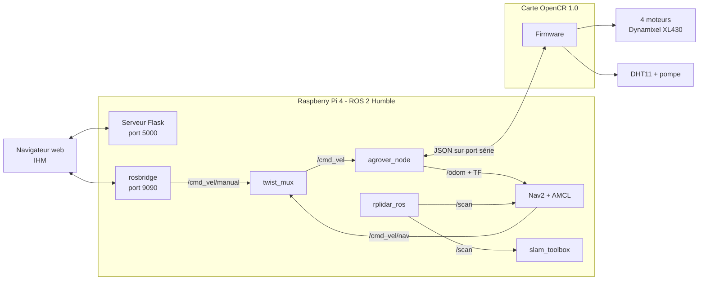
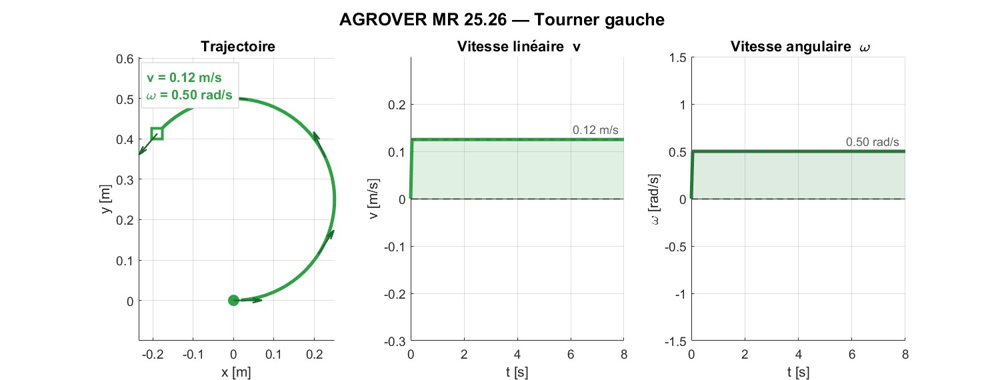

# AGROVER MR 25.26 — Rover agricole autonome sous ROS 2

Rover à quatre roues motrices capable d'être piloté depuis un navigateur web, de cartographier son environnement et de rejoindre seul un objectif choisi sur la carte. Il embarque un capteur de température et d'humidité ainsi qu'une pompe pour une action locale de pulvérisation.

*Autonomous agricultural rover: web teleoperation, SLAM mapping and Nav2 navigation on ROS 2 Humble, with an OpenCR low-level controller.*

Projet d'ingénierie de 4ᵉ année, filière Mécatronique-Robotique, JUNIA HEI (septembre 2025 – avril 2026).


## Ce que fait le rover

- **Téléopération web** : pilotage depuis un téléphone ou un ordinateur, sans application à installer, avec retour vidéo de la caméra.
- **Cartographie** : construction d'une carte 2D avec le LiDAR et `slam_toolbox`, enregistrable depuis l'interface.
- **Navigation autonome** : le rover rejoint un objectif cliqué sur la carte avec Nav2, en évitant les obstacles.
- **Arbitrage des commandes** : la commande manuelle reste prioritaire sur la navigation autonome, et l'arrêt d'urgence est prioritaire sur tout.
- **Mesure et action** : lecture de la température et de l'humidité (DHT11), commande d'une pompe de pulvérisation.
- **Sécurité** : le firmware arrête les moteurs si aucune commande n'arrive pendant 500 ms.

## Architecture



Le rover repose sur deux étages :

- **Bas niveau, carte OpenCR** : le firmware pilote les quatre moteurs, lit le capteur DHT11, commande la pompe et renvoie la vitesse des roues 20 fois par seconde.
- **Haut niveau, Raspberry Pi** : le nœud `agrover_node` convertit les commandes de vitesse en consignes moteurs, calcule l'odométrie et la publie pour `slam_toolbox` et Nav2.

## Matériel

| Élément | Référence |
|---|---|
| Carte de contrôle | ROBOTIS OpenCR 1.0 |
| Ordinateur embarqué | Raspberry Pi 4 (4 Go) |
| Moteurs | 4 × Dynamixel XL430-W250 |
| LiDAR | RPLidar A1 |
| Caméra | Raspberry Pi Camera v2 |
| Capteur | DHT11 (température et humidité) |
| Pompe | Pompe péristaltique Kamoer NKP, commandée par relais |
| Batterie | LiPo 3S 11,1 V, 5000 mAh |

Dimensions du châssis : 265 × 174 × 255 mm. Rayon des roues : 32,5 mm. Voie : 155 mm. Masse : environ 5 kg.

## Contenu du dépôt

```
agrover-rover/
├── agrover_ros/        Paquet ROS 2 : nœud principal, cinématique, lancement, configuration, URDF
├── agrover_ihm/        Interface web : serveur Flask et page de contrôle
├── firmware/           Firmware de la carte OpenCR (Arduino)
│   ├── agrover_opencr_firmware/   Version utilisée avec ROS 2
│   └── legacy/firmware_agrover/   Première version, téléopération seule
├── teleop/             Téléopération au clavier, sans ROS (Raspberry Pi et Windows)
├── simulation/         Simulation MATLAB du modèle cinématique et figures
└── install_ihm.sh      Script d'installation sur le Raspberry Pi
```

## Installation

Prérequis : Raspberry Pi sous Ubuntu 22.04 avec ROS 2 Humble installé.

### 1. Firmware de l'OpenCR

1. Ouvrir `firmware/agrover_opencr_firmware/agrover_opencr_firmware.ino` dans l'IDE Arduino, avec le support de la carte OpenCR installé.
2. Installer les bibliothèques `DynamixelSDK` (ROBOTIS) et `DHT sensor library` (Adafruit).
3. Téléverser le programme sur la carte.

### 2. Paquet ROS 2

```bash
mkdir -p ~/agrover_ws/src && cd ~/agrover_ws/src
git clone https://github.com/<votre-compte>/agrover-rover.git
cd ~/agrover_ws
colcon build --packages-select agrover_ros
source install/setup.bash
```

### 3. Interface web

```bash
cd ~/agrover_ws/src/agrover-rover
chmod +x install_ihm.sh
sudo ./install_ihm.sh
```

Le script installe les paquets ROS 2 et Python nécessaires, copie l'interface dans `~/agrover_ihm`, règle l'accès au port série de l'OpenCR et crée le service `agrover-ihm`, lancé au démarrage du Raspberry Pi.

## Utilisation

### Depuis l'interface web

Ouvrir `http://<adresse-ip-du-raspberry>:5000` dans un navigateur connecté au même réseau que le rover. L'interface permet de choisir le mode (base, cartographie, navigation), de piloter le rover, d'enregistrer la carte, de fixer un objectif et de commander la pompe.

### En ligne de commande

| Besoin | Commande |
|---|---|
| Démarrer le rover (moteurs, LiDAR, arbitrage) | `ros2 launch agrover_ros agrover_bringup.launch.py` |
| Cartographier | `ros2 launch agrover_ros agrover_slam.launch.py` |
| Naviguer sur une carte enregistrée | `ros2 launch agrover_ros agrover_nav.launch.py map:=/chemin/carte.yaml` |

### Téléopération au clavier, sans ROS

```bash
python3 teleop/agrover_teleop_rpi.py        # sur le Raspberry Pi
python teleop\agrover_teleop_windows.py     # sous Windows, après « pip install pyserial »
```

Touches : `Z` avancer, `S` reculer, `Q` et `D` tourner, `A` et `E` pivoter sur place, `Espace` arrêt, `P` pompe, `T` capteur.

## Réglages

Les paramètres du rover sont dans `agrover_ros/config/` :

| Fichier | Rôle |
|---|---|
| `params.yaml` | Port série, rayon des roues, voie, repères TF |
| `twist_mux.yaml` | Priorités entre commande manuelle, navigation et arrêt d'urgence |
| `slam_toolbox_params.yaml` | Cartographie |
| `nav2_params.yaml` | Navigation autonome |

Les cartes sont enregistrées par défaut dans `/home/rover/maps/`. Ce chemin est à adapter dans `slam_toolbox_params.yaml`, `agrover_nav.launch.py` et `agrover_ihm/app.py` si l'utilisateur du Raspberry Pi porte un autre nom.

## Modèle cinématique

Le rover est de type *skid-steer* : il tourne en imposant des vitesses différentes aux roues de gauche et de droite.

```
v  = (vD + vG) / 2        vG = v − ω · L / 2
ω  = (vD − vG) / L        vD = v + ω · L / 2
```

`v` est la vitesse linéaire, `ω` la vitesse angulaire, `vG` et `vD` les vitesses des roues gauches et droites, `L` la voie. La position est obtenue par intégration au point milieu, dans `agrover_ros/agrover_ros/kinematics.py`.

Le script `simulation/agrover_cinematique.m` rejoue six cas de déplacement (avancer, reculer, tourner à gauche et à droite, pivoter à gauche et à droite). Il utilise une voie de 0,30 m, différente de la voie mesurée du rover (0,155 m).



## Communication avec l'OpenCR

Le Raspberry Pi et l'OpenCR échangent des messages JSON, un par ligne, à 115 200 bauds.

| Message | Sens | Effet |
|---|---|---|
| `{"cmd":"MOVE_VEL","id1":n,"id2":n,"id3":n,"id4":n}` | vers l'OpenCR | Vitesse de chaque moteur, en unités Dynamixel |
| `{"cmd":"STOP"}` | vers l'OpenCR | Arrêt des moteurs |
| `{"cmd":"PUMP","state":1}` | vers l'OpenCR | Pompe en marche (1) ou à l'arrêt (0) |
| `{"cmd":"SENSOR"}` | vers l'OpenCR | Demande de lecture du DHT11 |
| `{"cmd":"PING"}` | vers l'OpenCR | Test de la liaison |
| `{"odom":{"vl":x,"vr":y}}` | vers le Raspberry Pi | Vitesses des roues gauches et droites en m/s, toutes les 50 ms |

Le firmware accepte aussi des commandes simples (`AVANCER`, `RECULER`, `GAUCHE`, `DROITE`, `PIVOT_G`, `PIVOT_D`, `SPEED`), utilisées par les scripts de téléopération au clavier.

## État du projet

Fonctionnel sur le rover réel : téléopération depuis l'interface web, cartographie avec `slam_toolbox`, navigation vers un objectif avec Nav2.

Prévu mais non réalisé faute de temps :

- missions à plusieurs points planifiées depuis l'interface ;
- retour automatique au point de départ quand la batterie est faible ;
- module de vision pour l'état des cultures ;
- alimentation séparée pour la logique et les actionneurs, suivi de la batterie dans l'interface, châssis plus robuste.

## Équipe

Projet AGROVER MR 25.26, mené par cinq étudiants de JUNIA HEI :

## Licence

Code distribué sous licence MIT, voir le fichier `LICENSE`.
